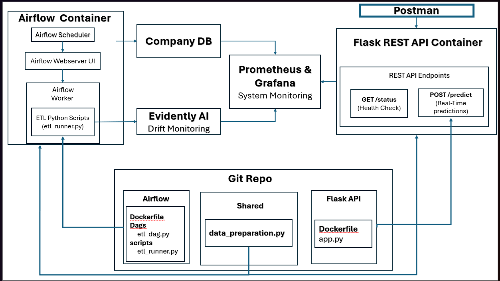
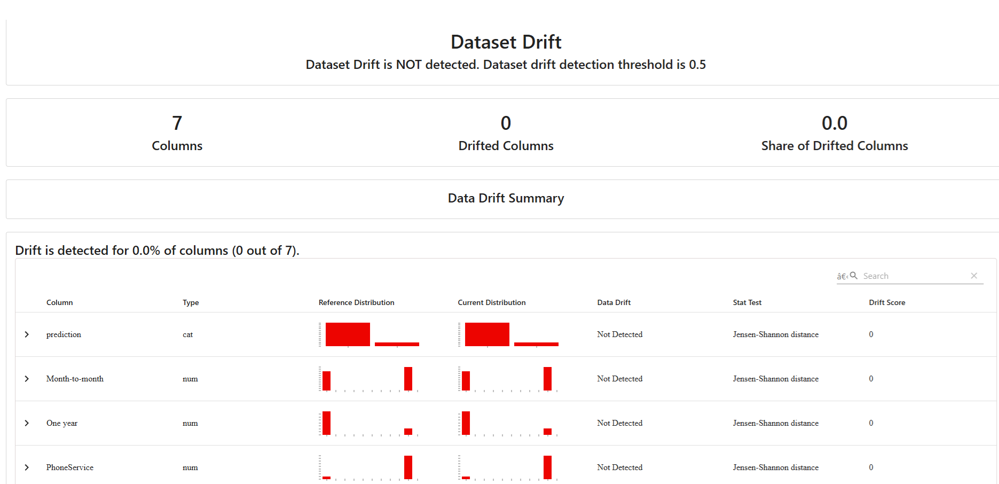

# 🚀 MLOps Project: Customer Churn Prediction

---

## 🎯 Project Overview

This project implements a robust Machine Learning Operations (MLOps) pipeline for predicting customer churn. It automates data extraction, transformation, and loading (ETL), enables both batch and real-time prediction capabilities, and continuously monitors data drift and model performance with automated alerts using Evidently AI.

---

## 📌 Project Goals

* **ETL Processing:** Automate data loading, transformation, and verification using Apache Airflow.
* **Batch Predictions:** Execute daily predictions using Airflow DAGs.
* **Real-Time Predictions:** Serve predictions via a Flask REST API.
* **Monitoring & Alerts:** Continuously track data drift and model performance using Evidently AI.

---

## 🛠️ Technology Stack

* **Containers & Orchestration:** Docker, Docker Compose
* **Workflow Automation:** Apache Airflow
* **Web API Framework:** Flask
* **Database:** PostgreSQL
* **Data Processing:** Pandas, SQLAlchemy
* **ML Framework:** scikit-learn
* **Monitoring:** Evidently AI

---

## 📐 Architecture Diagram



---

## 🗂️ Project Structure

* `airflow/` – Contains DAGs and ETL scripts
* `flask_api/` – API for real-time predictions
* `company_db_setup/` – Simulates a PostgreSQL database and initial data loading
* `shared_modules/` – Shared utilities (e.g transform part of ETL) and pretrained model (`churn_model.pickle`)
* `.env` – Environment variables for database credentials
* `config.yaml` – Configuration paths
* `Architecture.bmp` – Project architecture visualization

---

## 🔄 Components and Workflow

### 1️⃣ Airflow (Batch Processing)

Handles ETL operations and batch predictions.

#### Key DAGs

* **\[MUST RUN] Load & Verify CSV Data DAG:**

  * Path: `airflow/dags/load_and_verify_csv_data_to_company_db_dag.py`
  * Loads CSV data into PostgreSQL, verifies load, and tests transformations and predictions.

* **\[MUST RUN] Historical Predictions Update DAG:**

  * Path: `airflow/dags/update_historical_predictions_dag.py`
  * Updates historical predictions for accurate drift monitoring. Scheduled weekly/monthly or manual.

* **\[OPTIONAL] ETL Pipeline DAG:**

  * Path: `airflow/dags/etl_pipeline_dag.py`
  * Demonstrates generic ETL (extract-transform-load) processes.

* **\[MUST RUN] Batch Prediction DAG:**

  * Path: `airflow/dags/batch_processing_dag.py`
  * Daily extraction, transformation, prediction, and drift monitoring.

#### Airflow Web UI

* URL: [http://localhost:8080](http://localhost:8080)
* Credentials: `admin` (password available in Docker logs)

---

### 2️⃣ Flask API (Real-Time Predictions)

Immediate predictions using a trained churn model.

#### Endpoints

* **Health Check:**

  ```bash
  curl http://localhost:5000/health
  ```

* **Prediction Request:**

  ```bash
  curl -X POST http://localhost:5000/predict \
  -H "Content-Type: application/json" \
  -d '{"TotalCharges": 500.0, "Contract": "Month-to-month", "PhoneService": "Yes", "tenure": 10}'
  ```

---

### 3️⃣ Evidently AI (Monitoring)

Tracks data drift and model performance.

* **Report Output:** `company_db_setup/data_files/evidently_report.html`

* **View Report:**

  ```bash
  cd company_db_setup/data_files
  python -m http.server 8000
  ```

  * Visit: [http://localhost:8000/evidently\_report.html](http://localhost:8000/evidently_report.html)

#### Example Report



---

## ⚙️ Environment Configuration

Set PostgreSQL credentials explicitly by creating `.env` from `.env_example`:

```bash
cp .env_example .env
```

---

## 🚦 Running the Project

### Container Setup

```bash
docker-compose down -v --remove-orphans
rm -rf ./db_data
docker-compose build --no-cache
docker-compose up -d

# Wait ~30 seconds for Airflow initialization
sleep 30

# Retrieve Airflow admin password
docker-compose logs airflow | grep -i "admin"
```

### Manual DAG Execution

Manually trigger these DAGs via the Airflow UI:

1. `load_and_verify_csv_data_to_company_db_dag`
2. `update_historical_predictions_dag`
3. `batch_processing_dag`

---

## ✅ Quick Reference

| Component        | URL                                            | Note                    |
| ---------------- | ---------------------------------------------- | ----------------------- |
| Airflow Web UI   | [http://localhost:8080](http://localhost:8080) | Admin password in logs  |
| Flask API        | [http://localhost:5000](http://localhost:5000) | Real-time predictions   |
| Evidently Report | [http://localhost:8000](http://localhost:8000) | Drift monitoring report |

---

🎉 **Happy MLOps-ing!** 🚀
